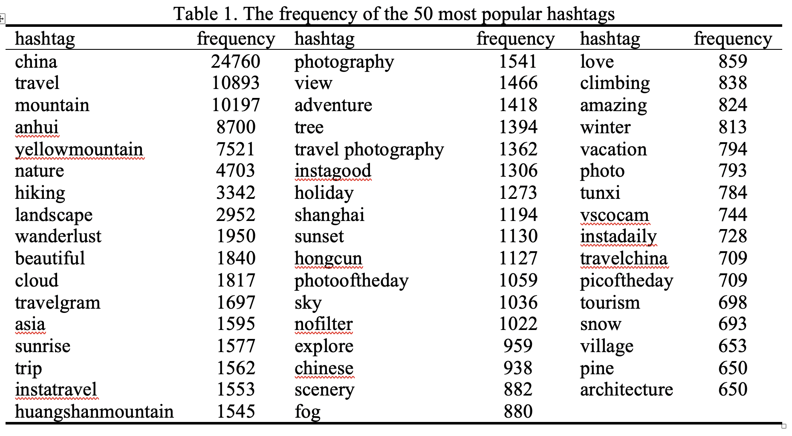
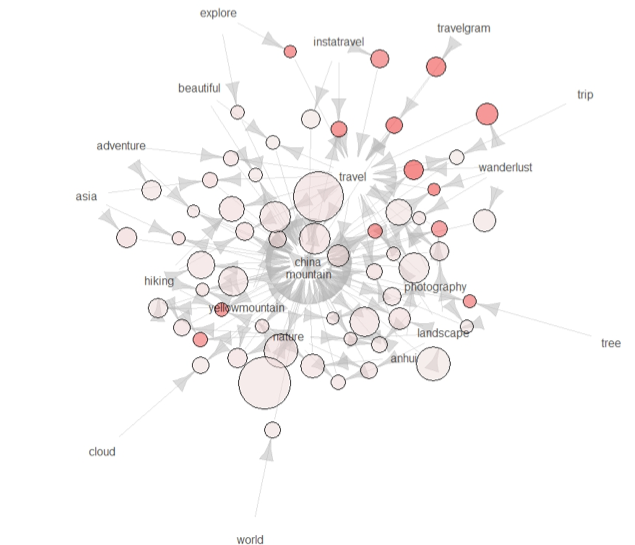
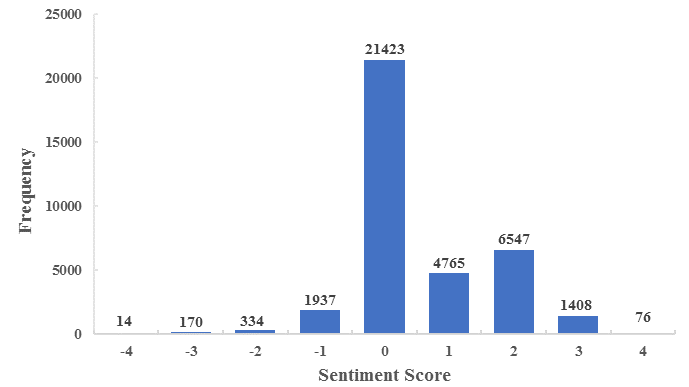
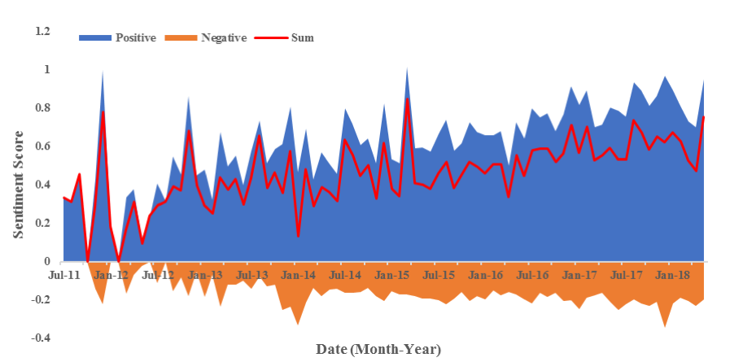
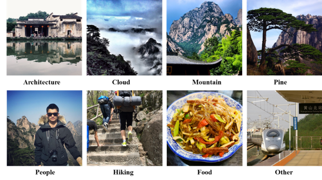
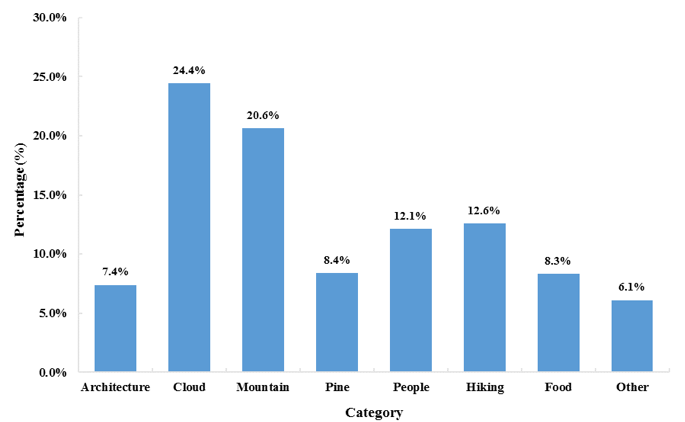

### Play with Instagram data ;-)
Understanding international tourists’ perceptions and preferences is helpful for Destination Management Organizations (DMOs) and travel agencies to implement suitable planning and marketing strategy. However, it is not a trivial task owing to the insufficient data source. In this study, we explored international tourists’ perceptions and preferences about Huangshan City, China, under the lens of image-based social media: Instagram. This new data source can help address the limits with traditional data sources (e.g. surveys, interviews, tourism statistics).  With 45145 photos (36981 posts) of Huangshan City from 13013 people between July 2011 and May 2018 collected from Instagram, we investigated the tourists’ opinions, attitudes, and emotions toward the tourist destination, Huangshan City with hashtag analysis, sentiment analysis, and visual analysis, and demonstrated the great potential of applying social media into tourism research. 

- The frequency of the 50 most popular hashtags

- A graph visualization for extracted association rule

- The distribution of sentiment score of Instagram text captions

- Sentiment analysis of Instagram text captions per month

- A sample of photos for each category in this study

- The distribution of photos in 8 categories

